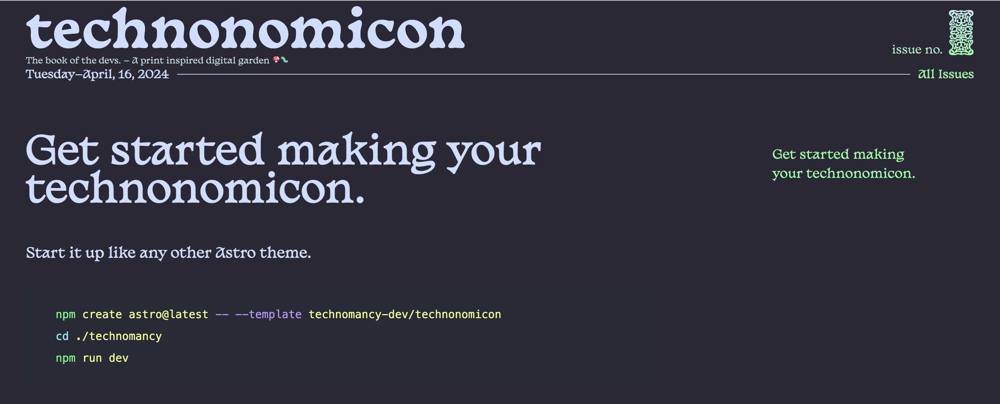

# NotToday

```sh
  npm create astro@latest -- --template technomancy-dev/technonomicon
  cd ./technonomicon
  npm run dev
```

> 🧙‍♂️ NotToday es un tributo a "Los hombres Libres de Braavoos", personajes ficticios de la serie GOT (Juego de tronos)



## 🚀 Project Structure

Inside of your Book of the devs, you'll see the following folders and files:

```text
├── public/
│   └── favicon.svg
├── src/
│   ├── components/
│   │   ├── Cards/
│   │   ├── Content/
│   │   ├── Icons/
│   │   ├── ArticleTeaser.astro
│   │   ├── Empty.astro
│   │   ├── Markdown.astro
│   │   ├── More.astro
│   │   └── Navigation.astro
│   ├── layouts/
│   │   ├── Article.astro
│   │   └── Layout.astro
│   └── pages/
│       ├── articles/
│       ├── cards/
│       ├── issues/
│       └── index.astro
└── package.json
```

Astro (the magic which powers the technonomicon) looks for `.astro` or `.md` files in the `src/pages/` directory. Each page is exposed as a route based on its file name.

There's nothing special about `src/components/`, but that's where we like to put any Astro/React/Vue/Svelte/Preact components.
It has come pre-loaded with components to manipulate content, and create Cards.

It has come pre-loaded with components to manipulate content, and create Cards.
`Empty` and `More` are simple components used to negate, or pass on particular MDX components when remixing content. `Markdown` takes a markdown source and components and renders them. `ArticleTeaser.astro` grabs just the teaser info from an article. `Navigation.astro` is a navigation (duh).

Any static assets, like images, can be placed in the `public/` directory.

## 🧞 Commands

All commands are run from the root of the project, from a terminal:

| Command                   | Action                                           |
| :------------------------ | :----------------------------------------------- |
| `npm install`             | Installs dependencies                            |
| `npm run dev`             | Starts local dev server at `localhost:4321`      |
| `npm run build`           | Build your production site to `./dist/`          |
| `npm run preview`         | Preview your build locally, before deploying     |
| `npm run astro ...`       | Run CLI commands like `astro add`, `astro check` |
| `npm run astro -- --help` | Get help using the Astro CLI                     |

## 👀 Want to learn more?

Feel free to check [our documentation](https://theme.technomancy.dev) 
<!-- or jump into our [Discord server](https://astro.build/chat). -->
